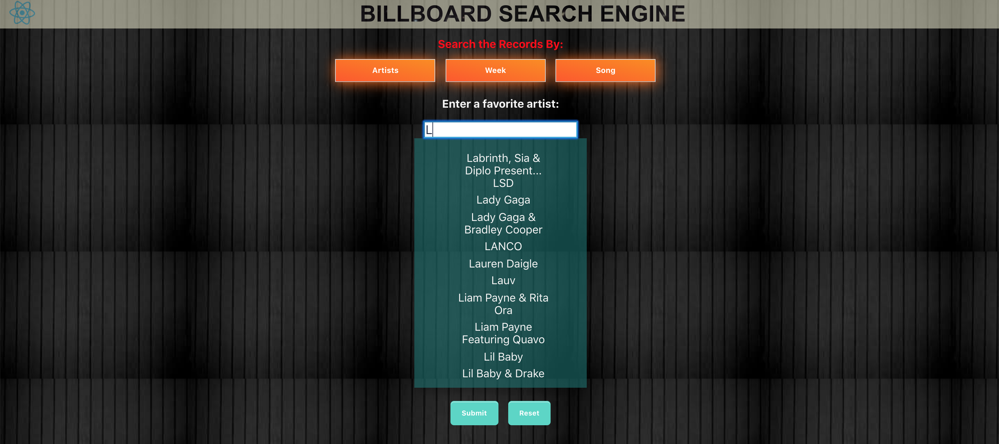
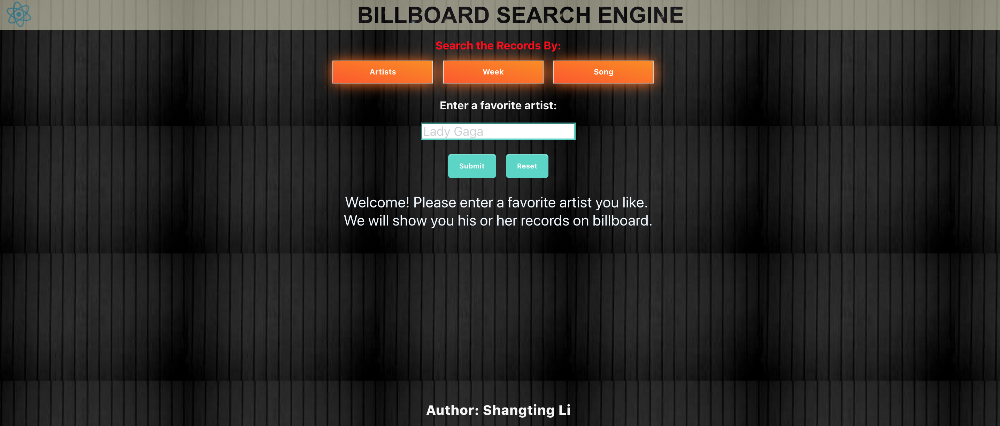

## README (billboard-search)

Search billboard records according to artist name, week and song name.





---
### Install
* Download the [Project](https://github.com/Shangtingli/billboard-engine/archive/master.zip)
#### Building The Database
* Make sure npm, python3, mysql works in your machine
* Change mysql utilities in db/DBCreation.py
* Run
```python3
python3 db/DBCreation.py
```

#### Start the Engine
* Run
```
npm start
```

* After your first run of npm start completes, you can see there are one **node_modules** directory created in root directory,
  client directory, and server directory. For speed purposes you can get rid of the *"npm install"* in line 7, line 8, and line 9 in  **package.json** in root directory. The corresponding lines of code is shown below.
  
```
  7 "client": "cd client && npm install && npm start",
  8 "server": "cd server && npm install && npm start",
  9 "start": "npm install && concurrently --kill-others \"npm run server\" \"npm run client\""
```
---
### Trouble Shooting

* If your are getting error messages that ports are already in use such as:

```
Port 3001 is already in use
[nodemon] app crashed - waiting for file changes before starting...
Something is already running on port 3000.
```
  
*  Try the following Command, should fix the problem:

```
killall -9 node
```
---
### Contributor
* [Shangting Li](https://github.com/shangtingli)
